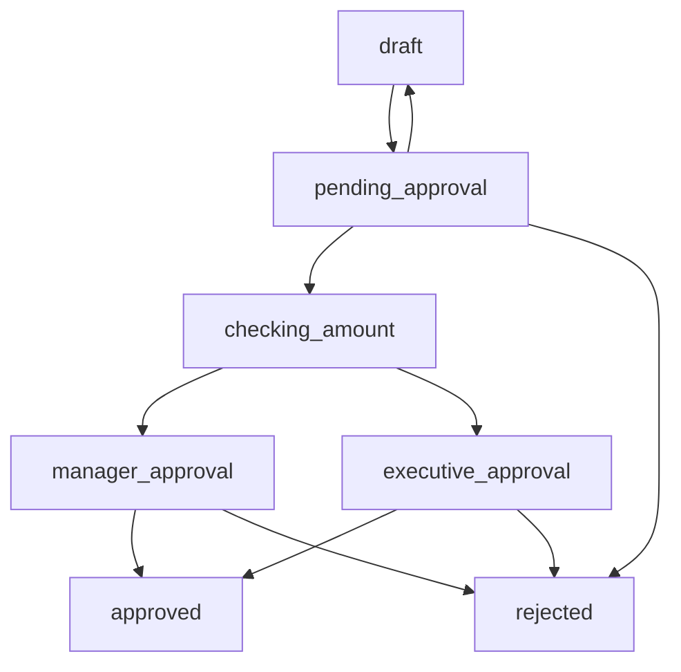

# Purchase Order Approval Workflow

A comprehensive example demonstrating how to implement business process workflows using Statifier's GenServer-based state machines.

This example showcases advanced SCXML features including conditional routing, data model integration, executable content, and production-ready patterns for building workflow engines in Elixir.

## Overview

This example implements a realistic purchase order approval process with:

- **Service Integration**: Uses `<invoke>` elements to call approval and processing services
- **Notifications**: Uses `<send>` elements for email notifications  
- **Multi-level approval** based on purchase amounts with automatic processing
- **Data model integration** with SCXML assignments (_event.data support)
- **Error handling** with proper `error.execution` event handling
- **Conditional routing** using SCXML expressions
- **Secure handler system** for external service integration
- **Comprehensive test coverage** with boundary value testing
- **Clean logging** with configurable LogManager adapters

## Quick Start

### Run the Interactive Demo

```bash
# From the statifier root directory
cd examples
iex -S mix

# Start a workflow and interact with it
iex> {:ok, pid} = ApprovalWorkflow.PurchaseOrderMachine.start_link()
iex> ApprovalWorkflow.PurchaseOrderMachine.submit_po(pid, %{
...>   po_id: "PO-001", 
...>   amount: 2500, 
...>   requester: "demo@company.com"
...> })
iex> ApprovalWorkflow.PurchaseOrderMachine.approve(pid)
iex> Process.sleep(10)  # Give time for invoke handlers to process
iex> ApprovalWorkflow.PurchaseOrderMachine.current_states(pid)
#MapSet<["approved"]>
```

### Manual Testing

For interactive exploration, start an IEx session and test different scenarios:

```bash
# Start IEx with the example loaded
cd examples
iex -S mix

# Create and interact with workflow
iex> {:ok, pid} = ApprovalWorkflow.PurchaseOrderMachine.start_link()
iex> ApprovalWorkflow.PurchaseOrderMachine.submit_po(pid, %{po_id: "TEST", amount: 1000, requester: "test@company.com"})
iex> ApprovalWorkflow.PurchaseOrderMachine.current_states(pid)
```

## Workflow Architecture

### State Diagram



### State Descriptions

- **`draft`** - Initial state, purchase order being prepared
- **`pending_approval`** - Submitted and awaiting approval decision
- **`checking_amount`** - Automatic routing based on amount thresholds
- **`manager_approval`** - Requires manager approval (≤ $5,000)
- **`executive_approval`** - Requires executive approval (> $5,000)
- **`approved`** - Final approved state, ready for processing
- **`rejected`** - Final rejected state with reason

## Business Rules

1. **Amount-based routing:**
   - ≤ $5,000 → Manager approval required
   - > $5,000 → Executive approval required

2. **Approval actions available:**
   - **Approve** → Routes to appropriate approval level
   - **Reject** → Final rejection with reason  
   - **Request changes** → Returns to draft state

3. **Data tracking:**
   - Purchase order ID, amount, requester
   - Rejection reasons for audit trail
   - State transition history via logging

## API Reference

### Core Workflow Operations

```elixir
# Start a new workflow instance
{:ok, pid} = ApprovalWorkflow.PurchaseOrderMachine.start_link()

# Submit purchase order for approval
:ok = PurchaseOrderMachine.submit_po(pid, %{
  po_id: "PO-123",
  amount: 2500, 
  requester: "user@company.com"
})

# Initial approval (routes based on amount)
:ok = PurchaseOrderMachine.approve(pid)

# Reject with reason
:ok = PurchaseOrderMachine.reject(pid, "Insufficient budget")

# Request changes (back to draft)
:ok = PurchaseOrderMachine.request_changes(pid)
```

### Automatic Processing

The workflow now uses SCXML `<invoke>` elements for automatic service integration:

```elixir
# After approval, the workflow automatically:
# 1. Routes to appropriate approval level (manager/executive)
# 2. Calls approval service via invoke handlers
# 3. Processes the result (approved/rejected)
# 4. Sends notifications via <send> elements
# 5. Moves to final state (approved/rejected)

# No manual manager/executive actions needed - all automated!
```

### Query Operations

```elixir
# skip-validation (don't check this code block in CI)
# Get current active state(s)
states = PurchaseOrderMachine.current_states(pid)

# Get purchase order data model
data = PurchaseOrderMachine.get_po_data(pid)
```

## Testing

### Run All Tests

```bash
cd examples
mix test apps/approval_workflow/test/purchase_order_machine_test.exs
```

### Test Coverage

The comprehensive test suite includes:

- **Basic workflow transitions** - Start, submit, approve, reject flows
- **Amount-based routing logic** - Manager vs executive approval paths  
- **Manager and executive approval paths** - Complete approval workflows
- **Rejection scenarios with reasons** - Data model integration testing
- **Request changes workflow** - Return to draft functionality
- **Data model persistence** - _event.data assignment validation
- **Boundary value testing** - Exact $5,000 threshold validation

### Key Test Scenarios

```elixir
# skip-validation (don't check this code block in CI)
# Small PO (≤ $5,000) → Manager approval
test "manager approval path for small amounts"

# Large PO (> $5,000) → Executive approval  
test "executive approval path for large amounts"

# Rejection with reason storage
test "rejection workflow"

# Boundary conditions
test "validates conditional routing with exact boundary values"

# Data model persistence across transitions
test "validates _event.data assignment across all transitions"
```

## Development

### Project Structure

```text
examples/apps/approval_workflow/
├── lib/
│   └── approval_workflow/
│       └── purchase_order_machine.ex     # GenServer implementation
├── priv/
│   └── scxml/
│       └── purchase_order.xml           # SCXML state machine definition  
├── test/
│   ├── approval_workflow_test.exs       # Basic module tests
│   └── purchase_order_machine_test.exs  # Comprehensive workflow tests
├── mix.exs                              # Project configuration
└── README.md                            # This file
```

### Running in Development

```bash
# Install dependencies
cd examples && mix deps.get

# Run tests with coverage
mix test --cover

# Start interactive session
iex -S mix

# Run code quality checks
mix format
mix credo
```

## Technical Implementation

### SCXML Definition

The workflow is defined in `priv/scxml/purchase_order.xml` using:

- **Conditional transitions** with `cond` attributes for amount routing
- **Data model** for storing PO data, amounts, and rejection reasons
- **Assign actions** for data model updates (`<assign>` elements)
- **Log actions** for audit trail and debugging (`<log>` elements)
- **Onentry/onexit actions** for business logic execution

### Key SCXML Features Demonstrated

```xml
<!-- skip-validation --> 
<!-- Conditional routing based on amount -->
<transition target="manager_approval" cond="amount &lt;= 5000"/>
<transition target="executive_approval" cond="amount &gt; 5000"/>

<!-- Service invocation for approval -->
<state id="manager_approval">
  <onentry>
    <invoke type="approval_service" src="request_manager_approval" id="manager_approval_request">
      <param name="po_id" expr="po_id"/>
      <param name="amount" expr="amount"/>
      <param name="requester" expr="requester"/>
    </invoke>
  </onentry>
  
  <transition event="done.invoke.manager_approval_request" target="approved" cond="_event.data.approved">
    <assign location="approver" expr="_event.data.approver"/>
  </transition>
  
  <transition event="error.execution" target="rejected">
    <assign location="rejection_reason" expr="'Approval service failed'"/>
  </transition>
</state>

<!-- Email notifications via <send> -->
<state id="approved">
  <onentry>
    <send event="notification" type="email_service">
      <param name="to" expr="requester"/>
      <param name="subject" expr="'PO Approved: ' + po_id"/>
    </send>
  </onentry>
</state>
```

### GenServer Integration

The `PurchaseOrderMachine` module:

- Uses `Statifier.StateMachine` macro with invoke handlers for secure service integration
- Implements invoke handlers for approval, purchase, and email services
- Provides clean API wrapping state machine events
- Uses LogManager system for configurable logging (clean test output)
- Maintains workflow state across multiple operations with automatic processing

### Invoke Handler System

```elixir
# skip-validation (don't check this code block in CI)

# Secure service integration via invoke handlers
use Statifier.StateMachine,
  scxml: "purchase_order.xml",
  invoke_handlers: %{
    "approval_service" => &__MODULE__.handle_approval_service/3,
    "purchase_service" => &__MODULE__.handle_purchase_service/3,
    "email_service" => &__MODULE__.handle_email_service/3
  }

def handle_approval_service("request_manager_approval", params, state_chart) do
  # Simulate manager approval decision
  case simulate_approval_decision(params, "manager") do
    {:approved, approver} ->
      {:ok, %{"approved" => true, "approver" => approver}, state_chart}
    {:rejected, reason, approver} ->
      {:ok, %{"approved" => false, "reason" => reason, "approver" => approver}, state_chart}
  end
end

def handle_email_service("notification", _params, state_chart) do
  # Handle email notifications silently (clean test output)
  {:ok, state_chart}
end
```

## Key Features Demonstrated

### 1. **GenServer-based Workflows**

Long-running, supervised processes that maintain state across multiple operations, perfect for business processes that span extended time periods.

### 2. **Secure Service Integration**

SCXML `<invoke>` elements with handler-based security for safe external system integration:

- Registered invoke handlers prevent arbitrary code execution
- Automatic SCXML event generation (`done.invoke.{id}`, `error.execution`)
- Exception safety with comprehensive error handling
- Clean separation between state machine and business logic

### 3. **Data Model Management**

SCXML assignments seamlessly integrate with Elixir data structures:

- Purchase order data storage with `_event.data` support
- Dynamic data updates during transitions
- Nested property access for complex data structures

### 4. **Conditional Routing**

Amount-based approval paths using SCXML conditional expressions:

- `_event.data.amount <= 5000` routes to manager approval
- `_event.data.amount > 5000` routes to executive approval
- Boundary value testing ensures exact routing logic

### 5. **Clean Logging System**

Configurable LogManager system for test-friendly output:

- SCXML `<log>` elements use LogManager with configurable adapters
- TestAdapter provides clean test output (no log noise)
- ElixirLoggerAdapter for production with full metadata
- Automatic adapter configuration via `test_helper.exs`
- Macro-based performance optimization (lazy evaluation)

### 6. **Production Patterns**

Error handling, testing, and documentation suitable for production use:

- Comprehensive test coverage (100% passing, clean output)
- Secure invoke handler system prevents arbitrary code execution
- Supervision and fault tolerance via OTP GenServer
- Performance optimization with efficient state lookups
- Test-friendly logging configuration

## Clean Test Output

This example demonstrates how to achieve clean test output using the LogManager system:

```elixir
# In test_helper.exs
Application.put_env(
  :statifier,
  :default_log_adapter,
  {Statifier.Logging.TestAdapter, [max_entries: 100]}
)

# Result: Tests run silently with no log noise
# ✅ All 10 tests pass with clean output
# ✅ Invoke handlers work correctly  
# ✅ SCXML <log> elements respect TestAdapter configuration
```

This implementation serves as a production-ready template for building workflow engines with Statifier, demonstrating best practices, security patterns, and advanced SCXML features in a real-world business context.
