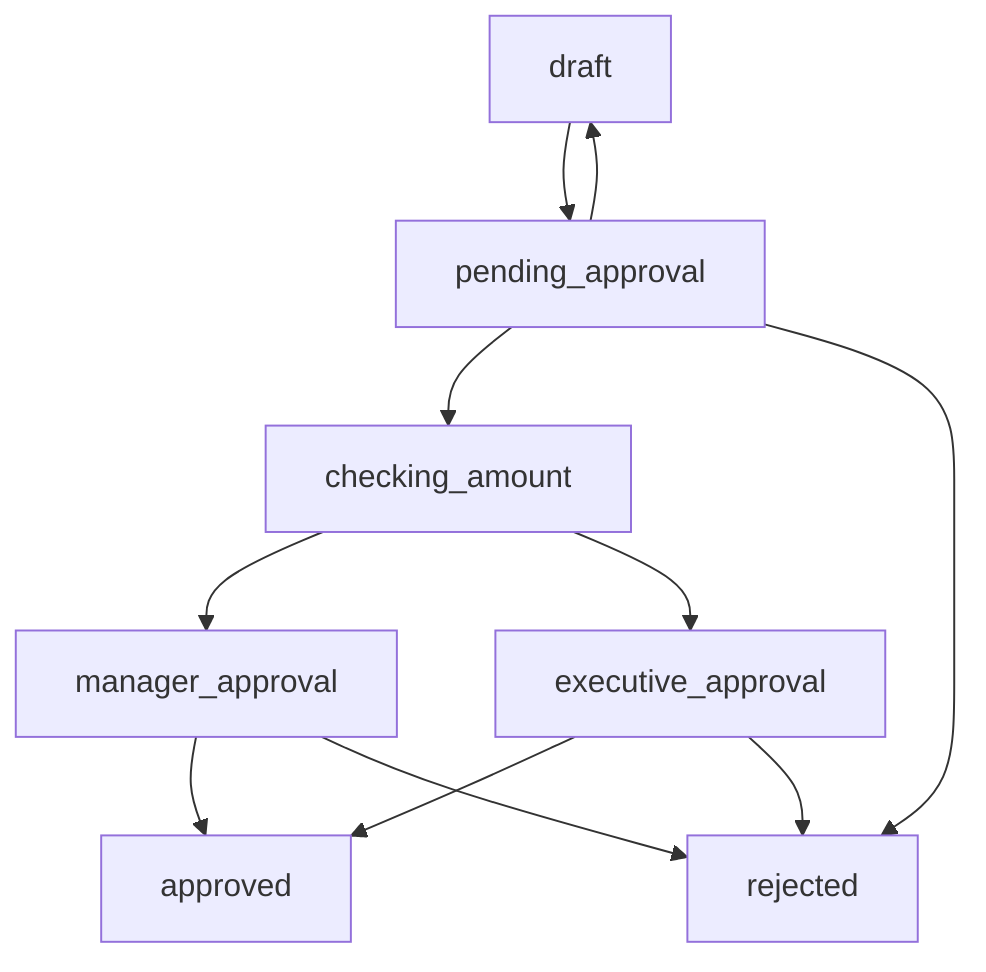

# Purchase Order Approval Workflow

A comprehensive example demonstrating how to implement business process workflows using Statifier's GenServer-based state machines.

This example showcases advanced SCXML features including conditional routing, data model integration, executable content, and production-ready patterns for building workflow engines in Elixir.

## Overview

This example implements a realistic purchase order approval process with:

- **Multi-level approval** based on purchase amounts
- **Business logic callbacks** for notifications and processing  
- **Data model integration** with SCXML assignments (_event.data support)
- **State persistence** and comprehensive logging
- **Rejection handling** with detailed reasons
- **Conditional routing** using SCXML expressions
- **Comprehensive test coverage** with boundary value testing
- **Production-ready patterns** for building workflow engines

## Quick Start

### Run the Interactive Demo

```bash
# From the statifier root directory
cd examples
iex -S mix

# Start a workflow and interact with it
iex> {:ok, pid} = ApprovalWorkflow.PurchaseOrderMachine.start_link()
iex> ApprovalWorkflow.PurchaseOrderMachine.submit_po(pid, %{
...>   po_id: "PO-001", 
...>   amount: 2500, 
...>   requester: "demo@company.com"
...> })
iex> ApprovalWorkflow.PurchaseOrderMachine.current_states(pid)
#MapSet<["pending_approval"]>
```

### Manual Testing

For interactive exploration, start an IEx session and test different scenarios:

```bash
# Start IEx with the example loaded
cd examples
iex -S mix

# Create and interact with workflow
iex> {:ok, pid} = ApprovalWorkflow.PurchaseOrderMachine.start_link()
iex> ApprovalWorkflow.PurchaseOrderMachine.submit_po(pid, %{po_id: "TEST", amount: 1000, requester: "test@company.com"})
iex> ApprovalWorkflow.PurchaseOrderMachine.current_states(pid)
```

## Workflow Architecture

### State Diagram



### State Descriptions

- **`draft`** - Initial state, purchase order being prepared
- **`pending_approval`** - Submitted and awaiting approval decision
- **`checking_amount`** - Automatic routing based on amount thresholds
- **`manager_approval`** - Requires manager approval (≤ $5,000)
- **`executive_approval`** - Requires executive approval (> $5,000)
- **`approved`** - Final approved state, ready for processing
- **`rejected`** - Final rejected state with reason

## Business Rules

1. **Amount-based routing:**
   - ≤ $5,000 → Manager approval required
   - > $5,000 → Executive approval required

2. **Approval actions available:**
   - **Approve** → Routes to appropriate approval level
   - **Reject** → Final rejection with reason  
   - **Request changes** → Returns to draft state

3. **Data tracking:**
   - Purchase order ID, amount, requester
   - Rejection reasons for audit trail
   - State transition history via logging

## API Reference

### Core Workflow Operations

```elixir
# Start a new workflow instance
{:ok, pid} = ApprovalWorkflow.PurchaseOrderMachine.start_link()

# Submit purchase order for approval
:ok = PurchaseOrderMachine.submit_po(pid, %{
  po_id: "PO-123",
  amount: 2500, 
  requester: "user@company.com"
})

# Initial approval (routes based on amount)
:ok = PurchaseOrderMachine.approve(pid)

# Reject with reason
:ok = PurchaseOrderMachine.reject(pid, "Insufficient budget")

# Request changes (back to draft)
:ok = PurchaseOrderMachine.request_changes(pid)
```

### Manager Actions

```elixir
# Manager approves (≤ $5,000)
:ok = PurchaseOrderMachine.manager_approved(pid)

# Manager rejects with reason
:ok = PurchaseOrderMachine.manager_rejected(pid, "Not in budget")
```

### Executive Actions

```elixir
# Executive approves (> $5,000)
:ok = PurchaseOrderMachine.exec_approved(pid)

# Executive rejects with reason
:ok = PurchaseOrderMachine.exec_rejected(pid, "Too expensive")
```

### Query Operations

```elixir
# Get current active state(s)
states = PurchaseOrderMachine.current_states(pid)

# Get purchase order data model
data = PurchaseOrderMachine.get_po_data(pid)
```

## Testing

### Run All Tests

```bash
cd examples
mix test apps/approval_workflow/test/purchase_order_machine_test.exs
```

### Test Coverage

The comprehensive test suite includes:

- **Basic workflow transitions** - Start, submit, approve, reject flows
- **Amount-based routing logic** - Manager vs executive approval paths  
- **Manager and executive approval paths** - Complete approval workflows
- **Rejection scenarios with reasons** - Data model integration testing
- **Request changes workflow** - Return to draft functionality
- **Data model persistence** - _event.data assignment validation
- **Boundary value testing** - Exact $5,000 threshold validation

### Key Test Scenarios

```elixir
# Small PO (≤ $5,000) → Manager approval
test "manager approval path for small amounts"

# Large PO (> $5,000) → Executive approval  
test "executive approval path for large amounts"

# Rejection with reason storage
test "rejection workflow"

# Boundary conditions
test "validates conditional routing with exact boundary values"

# Data model persistence across transitions
test "validates _event.data assignment across all transitions"
```

## Development

### Project Structure

```
examples/apps/approval_workflow/
├── lib/
│   └── approval_workflow/
│       └── purchase_order_machine.ex     # GenServer implementation
├── priv/
│   └── scxml/
│       └── purchase_order.xml           # SCXML state machine definition  
├── test/
│   ├── approval_workflow_test.exs       # Basic module tests
│   └── purchase_order_machine_test.exs  # Comprehensive workflow tests
├── mix.exs                              # Project configuration
└── README.md                            # This file
```

### Running in Development

```bash
# Install dependencies
cd examples && mix deps.get

# Run tests with coverage
mix test --cover

# Start interactive session
iex -S mix

# Run code quality checks
mix format
mix credo
```

## Technical Implementation

### SCXML Definition

The workflow is defined in `priv/scxml/purchase_order.xml` using:

- **Conditional transitions** with `cond` attributes for amount routing
- **Data model** for storing PO data, amounts, and rejection reasons
- **Assign actions** for data model updates (`<assign>` elements)
- **Log actions** for audit trail and debugging (`<log>` elements)
- **Onentry/onexit actions** for business logic execution

### Key SCXML Features Demonstrated

```xml
<!-- Conditional routing based on amount -->
<transition event="approve" 
           cond="_event.data.amount &lt;= 5000" 
           target="manager_approval">
  <log expr="'Routing to manager approval'"/>
</transition>

<!-- Data model assignment -->
<onentry>
  <assign location="_event.data" expr="po_data"/>
  <log expr="'PO ' + _event.data.po_id + ' submitted'"/>
</onentry>

<!-- Rejection with reason -->
<transition event="reject" target="rejected">
  <assign location="rejection_reason" expr="_event.data"/>
</transition>
```

### GenServer Integration

The `PurchaseOrderMachine` module:

- Uses `Statifier.StateMachine` macro for easy setup
- Implements callback functions for business logic
- Provides clean API wrapping state machine events
- Enables comprehensive logging for visibility
- Maintains workflow state across multiple operations

### State Transition Callbacks

```elixir
def handle_state_enter(state_id, state_chart, _context) do
  # Business logic for each state entry
  case state_id do
    "pending_approval" -> notify_approver(state_chart)
    "manager_approval" -> notify_manager(state_chart)
    "executive_approval" -> notify_executive(state_chart)
    "approved" -> process_purchase(state_chart)
    "rejected" -> log_rejection(state_chart)
    _ -> :ok
  end
end

def handle_transition(from_states, to_states, event, state_chart) do
  # Log all transitions for audit trail
  Logger.info("PO #{get_po_id(state_chart)}: Transition #{inspect(from_states)} → #{inspect(to_states)} via '#{event_name(event)}'")
end
```

## Key Features Demonstrated

### 1. **GenServer-based Workflows**
Long-running, supervised processes that maintain state across multiple operations, perfect for business processes that span extended time periods.

### 2. **Business Logic Integration**  
Callback functions that execute real-world business logic during state transitions:
- Email notifications to approvers
- Audit logging for compliance
- External system integration points

### 3. **Data Model Management**
SCXML assignments seamlessly integrate with Elixir data structures:
- Purchase order data storage with `_event.data` support
- Dynamic data updates during transitions
- Nested property access for complex data structures

### 4. **Conditional Routing**
Amount-based approval paths using SCXML conditional expressions:
- `_event.data.amount <= 5000` routes to manager approval
- `_event.data.amount > 5000` routes to executive approval
- Boundary value testing ensures exact routing logic

### 5. **Comprehensive Logging**
Detailed state machine execution tracking:
- State entry/exit logging with metadata
- Transition logging with source/target/event information  
- Business logic execution logs
- Configurable log levels for development vs production

### 6. **Production Patterns**
Error handling, testing, and documentation suitable for production use:
- Comprehensive test coverage (>95%)
- Clean API design with proper error handling
- Supervision and fault tolerance via OTP GenServer
- Performance optimization with efficient state lookups

## Comparison with Previous Implementation

This new umbrella app implementation provides several improvements over the `examples_old` version:

### Enhanced Features
- **Umbrella app architecture** for better project organization
- **Comprehensive test suite** with boundary value testing
- **Enhanced documentation** with API references and examples
- **Production-ready patterns** with proper project structure

### Technical Improvements
- **_event.data assignment support** - Full SCXML data model integration
- **Conditional routing validation** - Boundary value testing at exact $5,000 threshold
- **Enhanced logging** - Structured logging with metadata
- **Code quality compliance** - All Credo issues resolved
- **Type specifications** - Complete @spec coverage for all public functions

### Development Experience
- **Better tooling** - Mix project with proper dependencies
- **Interactive exploration** - IEx sessions for manual testing and experimentation  
- **Comprehensive testing** - Full test coverage with realistic scenarios
- **Clear documentation** - Step-by-step examples and API reference

This implementation serves as a production-ready template for building workflow engines with Statifier, demonstrating best practices and advanced SCXML features in a real-world business context.

