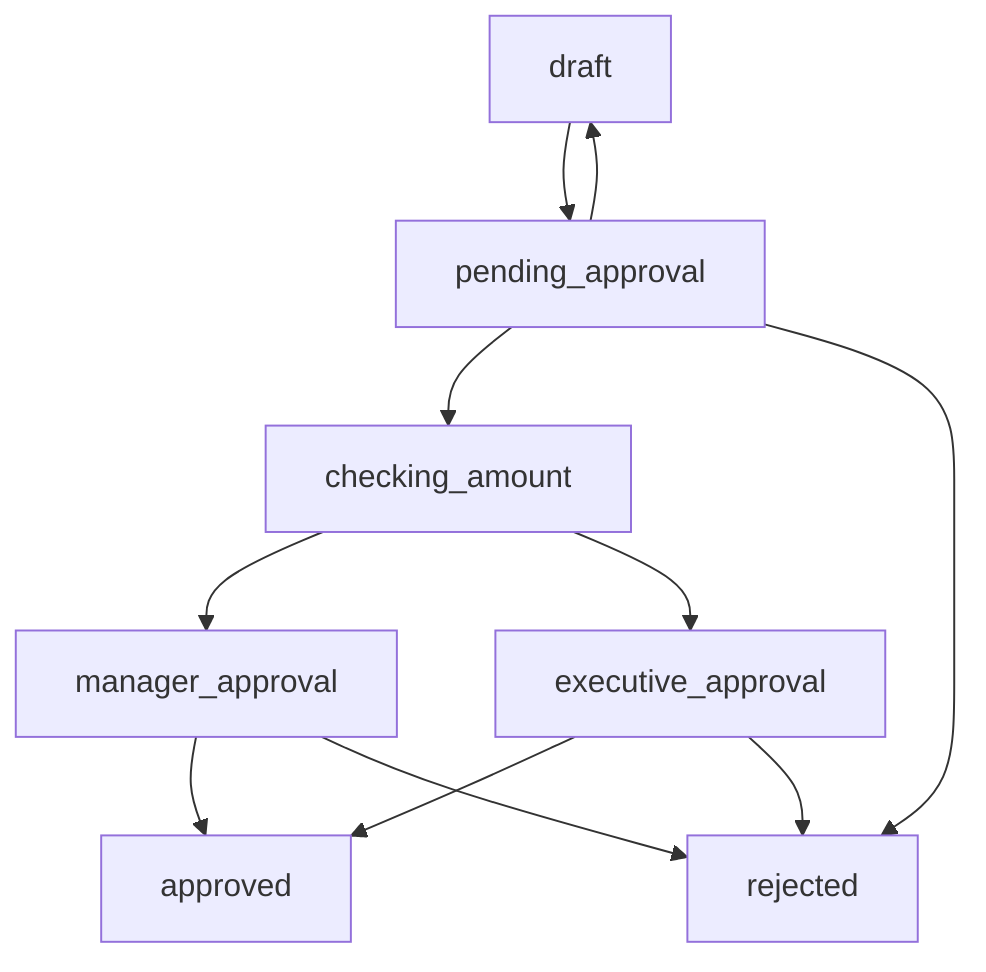

# Purchase Order Approval Workflow

A comprehensive example demonstrating how to implement business process workflows using Statifier's GenServer-based state machines.

## Overview

This example implements a realistic purchase order approval process with:

- **Multi-level approval** based on purchase amounts
- **Business logic callbacks** for notifications and processing
- **Data model integration** with SCXML assignments  
- **State persistence** and comprehensive logging
- **Rejection handling** with detailed reasons

## Workflow States



### State Descriptions

- **`draft`** - Initial state, purchase order being prepared
- **`pending_approval`** - Submitted and awaiting approval decision
- **`checking_amount`** - Automatic routing based on amount thresholds
- **`manager_approval`** - Requires manager approval (≤ $5,000)
- **`executive_approval`** - Requires executive approval (> $5,000)  
- **`approved`** - Final approved state, ready for processing
- **`rejected`** - Final rejected state with reason

## Business Rules

1. **Amount-based routing:**
   - ≤ $5,000 → Manager approval required
   - > $5,000 → Executive approval required

2. **Approval actions available:**
   - Approve → Routes to appropriate approval level
   - Reject → Final rejection with reason
   - Request changes → Returns to draft state

3. **Data tracking:**
   - Purchase order ID, amount, requester
   - Rejection reasons for audit trail
   - State transition history via logging

## Usage

### Basic Example

```elixir
# Start the workflow
{:ok, pid} = Examples.ApprovalWorkflow.PurchaseOrderMachine.start_link()

# Submit purchase order
:ok = PurchaseOrderMachine.submit_po(pid, %{
  po_id: "PO-123",
  amount: 2500,
  requester: "john.doe@company.com"
})

# Approve (routes to manager for $2,500)
:ok = PurchaseOrderMachine.approve(pid)

# Manager approves
:ok = PurchaseOrderMachine.manager_approved(pid)

# Check final state
states = PurchaseOrderMachine.current_states(pid)
# Returns: #MapSet<["approved"]>
```

### Advanced Usage with Logging

```elixir
# Start with trace-level logging for detailed state machine execution
{:ok, pid} = PurchaseOrderMachine.start_link(log_level: :trace)

# All state transitions, condition evaluations, and action executions
# will be logged with detailed metadata
```

## API Reference

### State Machine Operations

- `submit_po(pid, po_data)` - Submit purchase order for approval
- `approve(pid)` - Initial approval (routes based on amount)
- `reject(pid, reason)` - Reject with reason
- `request_changes(pid)` - Request changes (back to draft)

### Manager Actions

- `manager_approved(pid)` - Manager approves (≤ $5,000)
- `manager_rejected(pid, reason)` - Manager rejects with reason

### Executive Actions  

- `exec_approved(pid)` - Executive approves (> $5,000)
- `exec_rejected(pid, reason)` - Executive rejects with reason

### Query Operations

- `current_states(pid)` - Get active state(s)
- `get_po_data(pid)` - Get purchase order data model

## Running the Example

### Interactive Demo

```bash
# Run the complete demo with 3 scenarios
cd examples
mix examples.run approval_workflow
```

The demo shows:

1. **Small PO** ($2,500) → Manager approval → Approved
2. **Large PO** ($15,000) → Executive approval → Approved  
3. **Rejection** scenario with reason

### Manual Testing

```bash
# Start IEx with the example loaded
cd examples
iex -S mix

# Create and interact with workflow
iex> {:ok, pid} = Examples.ApprovalWorkflow.PurchaseOrderMachine.start_link()
iex> PurchaseOrderMachine.submit_po(pid, %{po_id: "TEST", amount: 1000, requester: "test"})
iex> PurchaseOrderMachine.current_states(pid)
```

## Testing

Comprehensive test suite covering:

```bash
# Run all tests
mix test

# Run with verbose output to see state transitions  
mix test --trace
```

**Test Coverage:**

- Basic workflow transitions
- Amount-based routing logic
- Manager and executive approval paths
- Rejection scenarios with reasons
- Request changes workflow
- Data model persistence

## Technical Implementation

### SCXML Definition

The workflow is defined in `scxml/purchase_order.xml` using:

- **Conditional transitions** with `cond` attributes for amount routing
- **Data model** for storing PO data, amounts, and rejection reasons
- **Logging actions** for audit trail and debugging
- **Assignment actions** for data model updates

### GenServer Integration

The `PurchaseOrderMachine` module:

- Uses `Statifier.StateMachine` macro for easy setup
- Implements callback functions for business logic
- Provides clean API wrapping state machine events
- Enables debug logging by default for visibility

### State Transition Callbacks

```elixir
def handle_state_enter(state_id, state_chart, _context) do
  # Business logic for each state entry
  # - Send notifications
  # - Log state changes  
  # - Trigger external systems
end
```

## Key Features Demonstrated

1. **GenServer-based Workflows** - Long-running, supervised processes
2. **Business Logic Integration** - Callbacks for real-world logic
3. **Data Model Management** - SCXML assignments with Elixir data
4. **Conditional Routing** - Amount-based approval paths
5. **Comprehensive Logging** - Detailed state machine execution
6. **Production Patterns** - Error handling, testing, documentation

This example serves as a template for building production workflow engines with Statifier.
